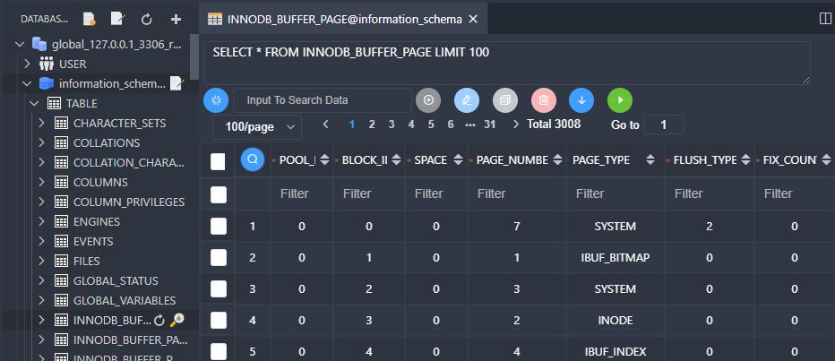
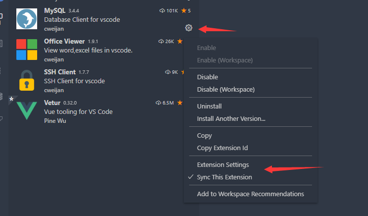

# Database Client

[

该项目为Visual Studio Code的数据库客户端插件, 支持MySQL/MariaDB, Microsoft SQL Server, PostgreSQL, SQLite, MongoDB, Redis以及ElasticSearch的管理.

- 功能
  - [连接](#连接)
  - [数据表](#数据表)
  - [执行SQL](#执行SQL)
  - [生成测试数据](#生成测试数据)
  - [历史记录](#历史记录)
  - [备份/导出](#备份/导出)
  - [设置](#设置)
  - [表过滤](#表过滤)

## 安装

在 Visual Studio Code 扩展中心安装 [Database Client](https://marketplace.visualstudio.com/items?itemName=cweijan.vscode-mysql-client2).

## 连接

1. 打开左侧数据库面板, 点击添加按钮
2. 在连接页面配置相应的数据库信息

## 数据表

1. 点击数据库表打开数据视图
2. 之后便可在页面进行CRUD、数据导出(**Excel、JSON**)等操作.

## 执行SQL

* 点击数据库节点的`New Query` 按钮.
* 之后可在编辑器中编辑和执行SQL(快捷键 : F9).
* 

## 生成测试数据

- 该扩展提供一键生成虚拟数据的功能, 再也不用为没有测试数据而烦恼.

## 历史记录

- 点击历史记录按钮后可查看以往执行的Sql记录.

## Sqlite

如果你用Linux或者Mac系统, 需要先安装sqlite3.

- Debian, Ubuntu:`sudo apt-get install sqlite`
- CentOS, Fedora, RedHat:`sudo yum install sqlite3`
- MacOS:`brew install sqlite3`

## 备份/导入

* 在表或者数据库节点右击, 之后便可以进行数据的导入导出.

## 设置

该扩展包含一些设置, 可通过以下方式打开设置界面.

## 表过滤

用于快速筛选数据表.

# 致谢

- [vscode-mysql](https://github.com/formulahendry/vscode-mysql): 本插件的灵感来源
- [mysqldump](https://github.com/bradzacher/mysqldum): 数据备份库.
- [sql-formatter](https://github.com/zeroturnaround/sql-formatter) Sql格式化库.
- [umy-ui](https://github.com/u-leo/umy-ui): 表数据渲染库.
- 核心连接库:

  - [node-mysql2](https://github.com/sidorares/node-mysql2) : Mysql client.
  - [node-postgres](https://github.com/brianc/node-postgres): PostgreSql client.
  - [tedious](https://github.com/tediousjs/tedious): SqlServer client.
